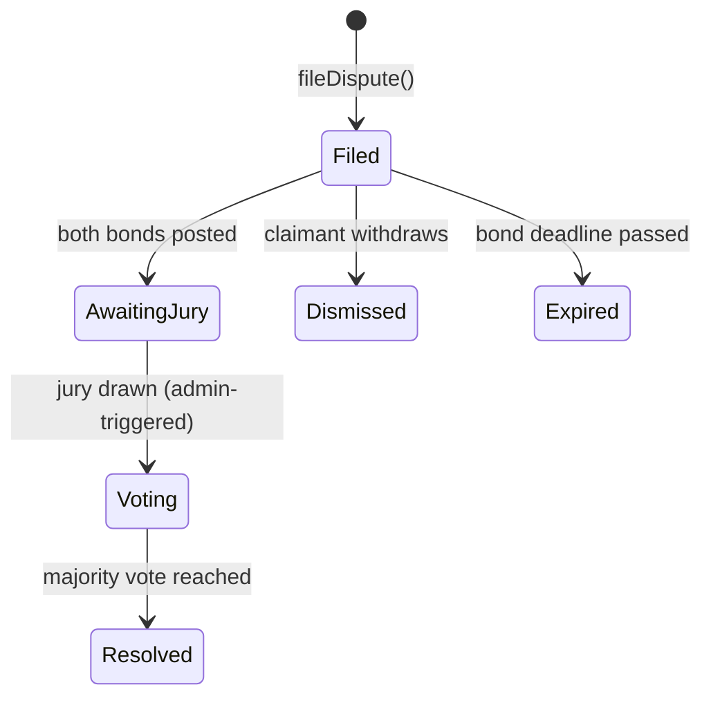
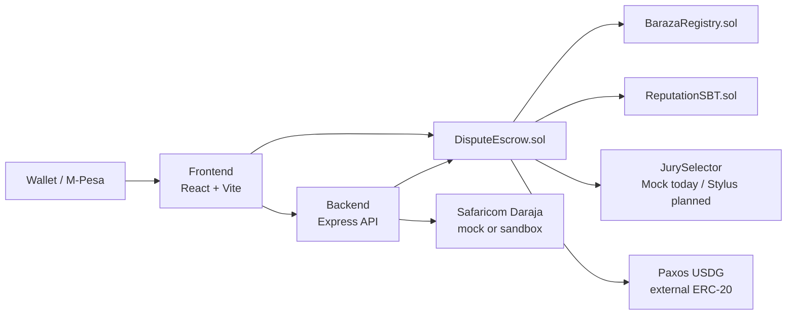

# Architecture

## Dispute lifecycle

## System components

## Why two languages for contracts

The jury-selection algorithm is weighted sampling *without replacement* —
a per-draw scan over the candidate pool. `MockJurySelector.sol` (Solidity)
implements this correctly today and is what's actually deployed and
tested. The Stylus/Rust version compiles the identical algorithm to WASM,
which runs that scan more cheaply as circle size grows — see
`contracts-stylus/README.md` for what's been verified there versus what
hasn't yet (the Stylus SDK build itself, not the algorithm).

## Bond currencies

`DisputeEscrow` supports three ways to fund a bond, converging on the same
on-chain state:

| Path | Who calls it | Asset moves |
|---|---|---|
| `postBondNative` | The user's own wallet | Native ETH |
| `postBondERC20` | The user's own wallet, after `approve()` | Allowlisted ERC-20 (Paxos USDG) |
| `confirmBondOffchain` | The backend relayer, after M-Pesa confirms | Tracked as bonded; settled off-chain |

USDG is gated behind `allowedBondTokens`, set by the contract admin —
a claimant can't file a dispute denominated in an arbitrary token.

## What's manual today, on purpose (not hidden)

- Jury selection is triggered by `POST /api/disputes/:id/select-jury`, not
  an automatic chain-event listener.
- Circle creation happens via `scripts/create-test-circle.js` or directly
  on `BarazaRegistry`, not yet a frontend page.

Both are named in the root README's "Known limitations" section too —
listed here again because this is where an engineer reading the
architecture would look for them first.